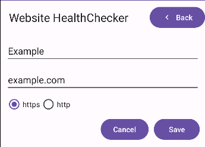
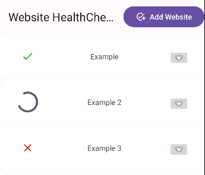
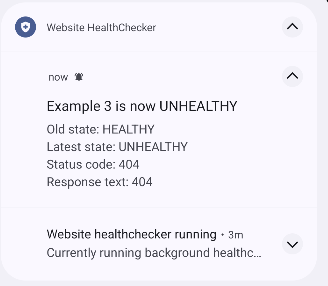

# Website Healthchecker
I were too lazy to implement a telemetry system in my cluster and figured it was easier to just create an app for it.
Now, perhaps 30 hours later, I realize I was very wrong, but I'm too committed to let this project go.

Open for anyone to fork, hack or to submit PRs.
It's currently not on Google Play but I might publish it once it's ready, still some minor quirks to figure out.

## Usecase
Add the websites you wish to track the health of, and this website healthchecker will periodically GET the page and store status.

You'll get dynamic notifications on health state change, going from healthy -> unhealthy and vise versa.
If the website turns unhealthy, you'll also see error code and store error message.

You can also checkout the health history by downloading a CSV showing all the checks this app has done.

Note that this is the health _as seen from your android device_.
If you go into a physical tunnel, with radio shadow, your websites will appear offline since you've lost coverage.

### Roadmap
- [x] Foreground service polling
- [x] Export health result history 
- [x] Website check CRUD fragment
- [ ] Modify check frequency
- [ ] Set specific error-codes as healthy (not just 200, as it is right now)
- [ ] Multiple protocols (not just http/https)
- [ ] History fragment 
